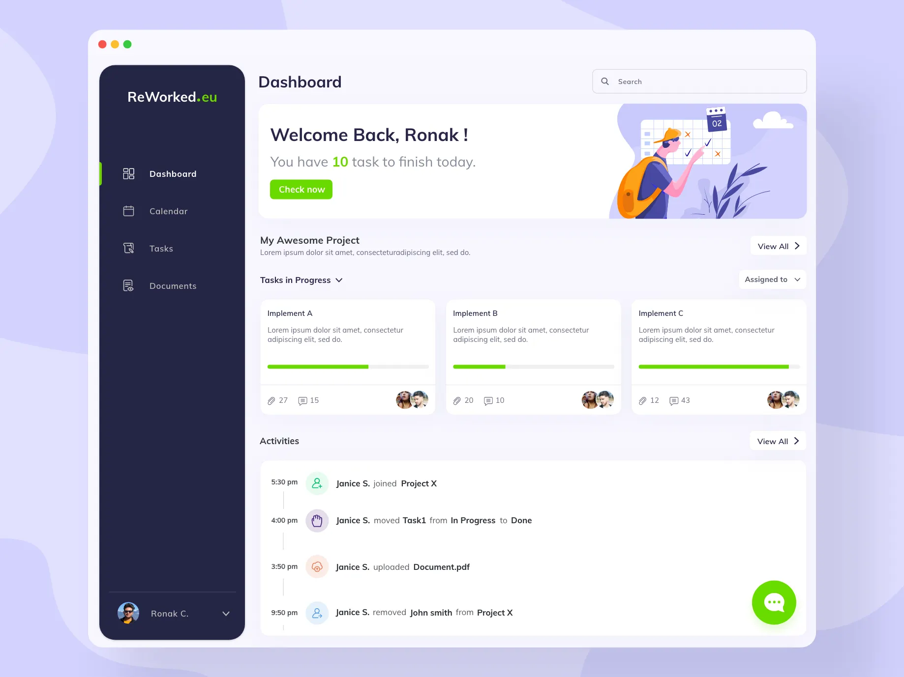
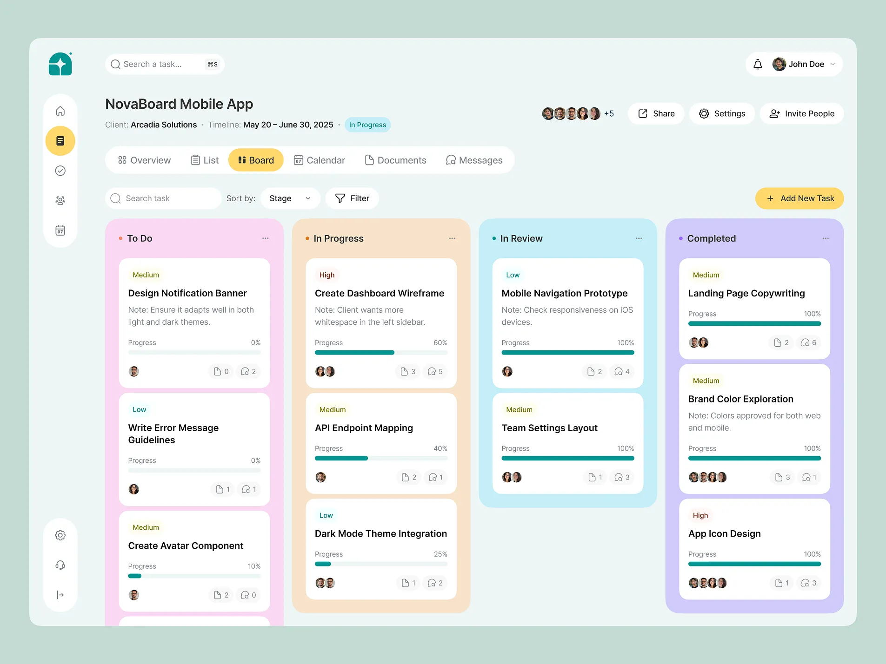
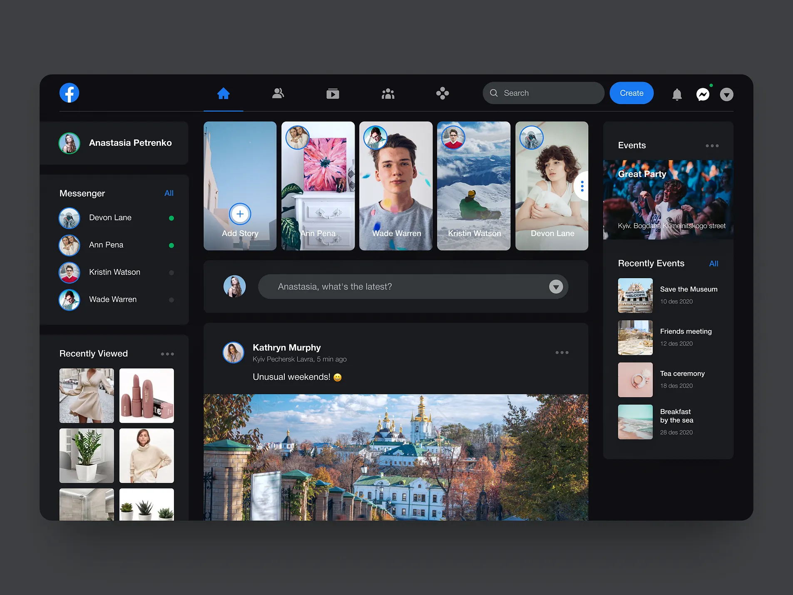
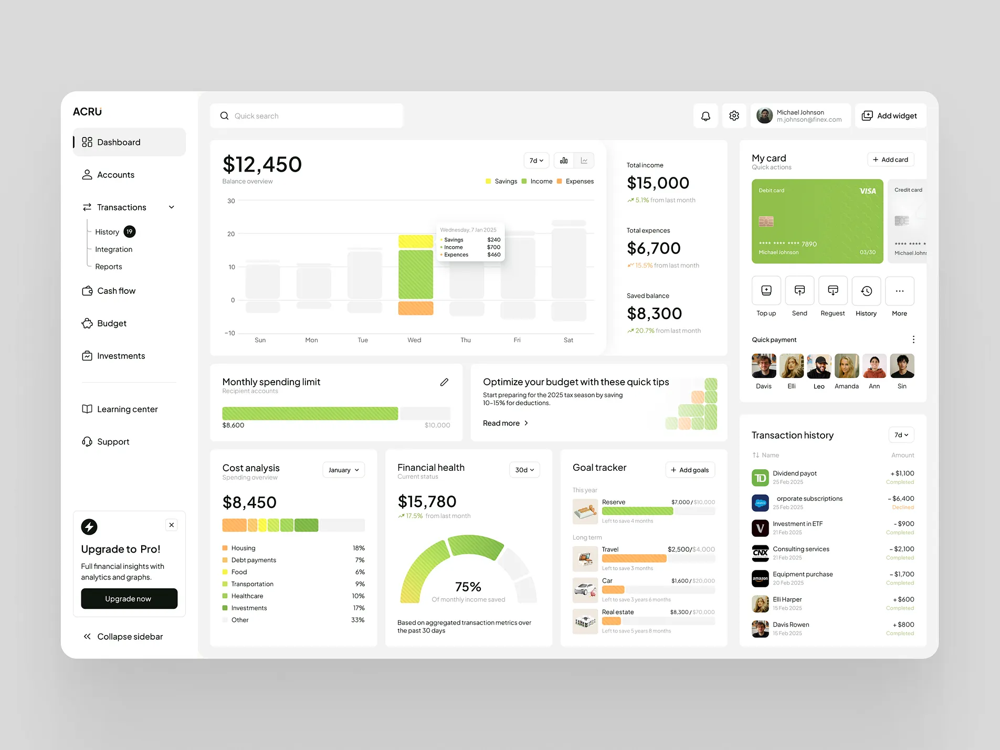

# Flutter Desktop Dashboard Design Collection

A collection of **4 pixel-perfect desktop dashboard UI designs** built entirely with Flutter — no third-party UI libraries, no network images. Every graphic, icon, and illustration is rendered using Flutter's `CustomPainter`.

---

## Screens

### Screen 1 — ReWorked.eu Project Dashboard

> A clean project management dashboard with a dark sidebar and light content area.



**Highlights:**
- Dark navy sidebar (`#1E2235`) with green active-nav indicator
- Welcome banner with custom-painted character illustration
- Task cards with progress bars and team avatar stacks
- Activity feed with timestamped event timeline
- Floating chat button · Search bar · User profile chip

---

### Screen 2 — NovaBoard Kanban Board

> A mint-sage themed kanban board for project task tracking.



**Highlights:**
- Mint-sage page background (`#A8CBBC`) with white rounded outer card
- Full-width white top bar — teal star logo, ⌘S search chip, user chip
- 60 px floating white pill sidebar with yellow active indicator
- 4 colour-coded kanban columns: To Do (pink), In Progress (peach), In Review (mint), Completed (lavender)
- Priority badges (Low / Medium / High) and teal progress bars

---

### Screen 3 — Facebook Dark UI Clone

> A faithful dark-mode recreation of the Facebook desktop feed layout.



**Highlights:**
- Dark surfaces (`#18191A` page, `#242526` panels, `#3A3B3C` inputs)
- Top bar with 5 nav icons, blue active underline, Create button, notification bubbles
- Left panel: user card, Messenger contacts with online dots, Recently Viewed grid
- Center feed: story row with abstract `CustomPainter` art, post composer, Kyiv cityscape painting
- Right panel: Events card with party scene CustomPainter, Recently Events list

---

### Screen 4 — ACRU Financial Dashboard

> A comprehensive personal finance dashboard with charts, budgets, and transaction history.



**Highlights:**
- Clean white layout with a collapsible left navigation sidebar
- Balance overview bar chart (Savings / Income / Expenses)
- KPI cards: Total Income `$15,000`, Total Expenses `$6,700`, Saved Balance `$8,300`
- Monthly spending limit progress bar and budget tips card
- Cost analysis breakdown, Financial health donut (75%), Goal tracker
- Right panel: virtual Visa debit card, Quick payment avatars, Transaction history table

---

## Project Structure

```
lib/
├── main.dart                        # Screen switcher with floating pill overlay
├── theme/
│   └── app_theme.dart               # AppColors + AppTextStyles (all screens)
└── screens/
    ├── screen1/
    │   ├── screen1.dart
    │   └── widgets/
    │       ├── sidebar.dart
    │       ├── welcome_banner.dart
    │       ├── task_card.dart
    │       └── activities_section.dart
    ├── screen2/
    │   ├── screen2.dart
    │   └── widgets/
    │       ├── s2_top_bar.dart
    │       ├── s2_sidebar.dart
    │       ├── s2_project_header.dart
    │       ├── s2_filter_bar.dart
    │       └── s2_kanban_board.dart
    ├── screen3/
    │   ├── screen3.dart
    │   └── widgets/  ...
    └── screen4/
        ├── screen4.dart
        └── widgets/  ...
```

## Key Conventions

| Convention | Detail |
|---|---|
| Color opacity | `.withValues(alpha: x)` — not the deprecated `.withOpacity()` |
| Theme file | All colors & text styles live in `lib/theme/app_theme.dart` |
| Color prefixes | `sN` prefix for Screen N constants (e.g. `s4Green`) |
| Images | Zero network images — avatars are `Container` circles with initials |
| Layout style | Floating cards: `Padding(16)` + `ClipRRect(borderRadius: 20–22)` |

## Running the App

```bash
# macOS desktop
flutter run -d macos

# Analyze
flutter analyze --no-fatal-infos
```

> Developed with Flutter 3.41.2 · Dart · macOS desktop target
